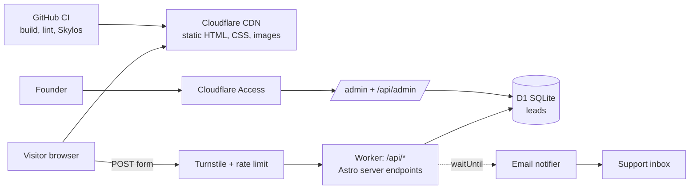

# The Consultant — Architecture

> Source of truth: [The Consultant — PRD & Architecture](https://claude.ai/artifact/BoGpRAjLmqokHo9YnewJFj) (Claude Docs, rev 19, exported 2026-09-25). Edit there, re-export here.

Product requirements: [PRD.md](PRD.md)

## System architecture

A static-first modular monolith on Cloudflare: pages are pre-rendered and served from the CDN, and one Worker handles the few writes. It is one deployable unit with clear internal modules — the Big Archive's "modular monolith" (p. 353) — because a two-founder firm needs simplicity now and clean seams for later.



Reads never touch the Worker; writes never touch the CDN cache. That split is the whole design.

**Components** (mapped to the Big Archive's "10 essential components of a production web app", p. 34):

| Component | Choice | Why |
| --- | --- | --- |
| Frontend framework | Astro 7, zero JS by default | Eight routes, content as files, SEO-heavy: the lowest framework that fits |
| CDN and hosting | Cloudflare (free tier), edge nodes in Lagos and Johannesburg | Static pages near West African users; no servers to patch |
| API | Astro server endpoints on a Cloudflare Worker | Same repo and deploy as the site; stateless, scales per request |
| Database | Cloudflare D1 (SQLite) | Relational, SQL, free up to 5 GB; lead volume is hundreds a month, not millions |
| Background work | `ctx.waitUntil` email after the response, plus an outbox column | Visitor never waits on email; unsent notifications are retried on the next write |
| Bot defence | Turnstile + honeypot + per-IP rate limit | Free, no puzzle for most users, no Google dependency |
| Admin auth | Cloudflare Access (email one-time code) in front of `/admin` | No passwords to build or store; free for up to 50 users |
| CI/CD | GitHub Actions: type-check, build, Skylos scan, deploy on merge | Every change is checked the same way |
| Monitoring | Workers Logs + Cloudflare Web Analytics (cookieless) | Enough to see errors and funnels without ad trackers |

**Request flows.** A page view is one CDN hit, usually cached at the edge. A form submit goes browser → Turnstile check → Worker validates the body → inserts into D1 with an idempotency key → returns `201` with a reference like `TC-7K3Q9` → schedules the email with `waitUntil`. If the Worker is unreachable, the form offers "Send on WhatsApp instead" with the typed message prefilled, so a lead is never lost to an outage.

## Data model and API

One `leads` table holds both enquiries and applications, told apart by `kind`; type-specific fields live in a validated JSON column. Content (tracks, services, team) is not in the database — it is versioned in the repo and built into static pages.

```sql
CREATE TABLE leads (
  id              TEXT PRIMARY KEY,          -- ULID
  reference       TEXT NOT NULL UNIQUE,      -- TC-XXXXX shown to the visitor
  idempotency_key TEXT NOT NULL UNIQUE,      -- client UUID, safe retries
  kind            TEXT NOT NULL CHECK (kind IN ('enquiry','application')),
  name            TEXT NOT NULL,
  email           TEXT,
  phone           TEXT,
  topic           TEXT NOT NULL,             -- enquiry type or track slug
  details         TEXT NOT NULL,             -- JSON, schema per kind
  status          TEXT NOT NULL DEFAULT 'new'
                  CHECK (status IN ('new','contacted','enrolled','closed','spam')),
  source_page     TEXT,
  ip_hash         TEXT,                      -- salted SHA-256 of client IP, rate limiting only
  notified_at     TEXT,                      -- NULL = email outbox pending
  created_at      TEXT NOT NULL DEFAULT (strftime('%Y-%m-%dT%H:%M:%fZ', 'now')),  -- ISO 8601 UTC
  updated_at      TEXT NOT NULL DEFAULT (strftime('%Y-%m-%dT%H:%M:%fZ', 'now')),
  CHECK (email IS NOT NULL OR phone IS NOT NULL)
);
CREATE INDEX leads_status_created ON leads (status, created_at DESC);
CREATE INDEX leads_created ON leads (created_at DESC);            -- admin list, all statuses
CREATE INDEX leads_ip_created ON leads (ip_hash, created_at);     -- rate-limit window lookup
CREATE INDEX leads_unnotified ON leads (notified_at) WHERE notified_at IS NULL;
```

**API** — resource-oriented, versioned, standard status codes, idempotent POSTs and cursor pagination, per the Big Archive's REST cheatsheet (p. 143) and "5 pillars of API design" (p. 168):

| Method and path | Purpose | Success | Errors |
| --- | --- | --- | --- |
| `POST /api/v1/enquiries` | Store an enquiry | `201` + `{reference}` | `400` invalid, `403` Turnstile failed, `429` rate-limited |
| `POST /api/v1/applications` | Store a training application | `201` + `{reference}` | same as above |
| `GET /api/v1/admin/leads?kind=&status=&cursor=` | List leads, 50 per page, newest first | `200` + `{items, nextCursor}` | `401` without Access |
| `PATCH /api/v1/admin/leads/{id}` | Change `status` | `200` | `400`, `401`, `404` |

Every POST carries an `Idempotency-Key` header generated when the form renders. A repeat with the same key returns the original `201` and reference instead of creating a duplicate — which matters on flaky mobile data where people tap Submit twice. Errors use one shape: `{error: {code, message, fields}}`, with `fields` mapping input names to messages the form shows inline.

## Scalability, reliability and observability

Expected load is small (hundreds of leads a month, low thousands of page views a day), so the design removes the Big Archive's three scalability bottlenecks — centralised components, high-latency components and tight coupling (p. 22) — without adding infrastructure to run.

| Principle (Big Archive) | Applied here |
| --- | --- |
| Statelessness (p. 22) | The Worker keeps no session state; any edge location can serve any request |
| Loose coupling, async processing (p. 22, p. 34) | Email is sent after the response via `waitUntil`; an outbox column retries failures, so a mail outage never blocks a lead |
| Caching at every layer (p. 301) | Hashed assets: `Cache-Control: public, max-age=31536000, immutable`. HTML: short edge TTL with `stale-while-revalidate`. API: `no-store` |
| Cache failure modes (p. 246) | No application cache to stampede; the CDN serves stale HTML if the origin build is unavailable |
| Frontend speed (p. 91) | Brotli, above-the-fold priority, preloaded brand font, lazy below-fold images, per-route CSS, no client framework |
| API performance (p. 71) | Cursor pagination on the admin list; one indexed query per request; D1 has no connection pool to exhaust |
| Rate limiting (p. 168) | 5 submits per IP per 10 minutes on the form endpoints, counted in D1 against a salted IP hash (ip\_hash), never the raw IP; `429` with `Retry-After` |

**Failure modes.** CDN edge down: Cloudflare routes to the next edge. Worker or D1 down: the form shows the WhatsApp fallback with the message kept. Email provider down: the lead is still stored and visible in `/admin`; the outbox retries. Bad deploy: Cloudflare keeps previous deployments, rollback is one click.

**Observability.** Structured JSON logs from the Worker (request id, route, status, latency, never form contents). Alerts to the founders' email on a 5xx rate over 2% for 10 minutes. Web Analytics tracks page views and three funnel events: form opened, form submitted, WhatsApp clicked.

**Growth path.** If leads reach the tens of thousands, add a real queue (Cloudflare Queues) for notifications and move reporting to a read replica. If a student portal arrives, it becomes a separate module with its own auth — the monolith's seams are already drawn.

## Security and quality gates

The attack surface is two public POST endpoints and one admin area; each control below maps to the Big Archive's API security tips (p. 65) and its SQL injection and XSS chapters (pp. 341, 347).

| Threat | Control |
| --- | --- |
| Spam and bots | Turnstile token verified server-side, hidden honeypot field, per-IP rate limit |
| SQL injection | Only parameterised D1 statements (`prepare().bind()`); no string-built SQL |
| XSS | Astro escapes output by default; admin renders lead text as text, never HTML; strict CSP with no inline scripts except hashed ones |
| Oversized or malformed input | Server-side schema validation with length caps (name 100, message 2,000 chars); body limit 16 KB |
| Admin access | Cloudflare Access in front of `/admin` and `/api/v1/admin/*`; the Worker also verifies the Access JWT, so a misrouted request still fails |
| Secrets | Turnstile secret and email API key stored as Worker secrets; never in the repo or client bundle |
| Personal data | Minimum fields, stated purpose, 24-month deletion job, no form contents in logs |

**Quality gates on every pull request:**

- `astro check` (TypeScript) and `astro build` must pass.
- **Skylos** static analysis (`skylos . -a`) for dead code, secrets, and security issues in TypeScript; `skylos cicd init` generates the GitHub Actions gate.
- Lighthouse CI on the home, training and contact pages: performance 90+, accessibility 95+.
- Motion-web acceptance floor: no console errors, no horizontal overflow at 320–1440 px, one `<h1>` per page, nothing stuck hidden under reduced motion.

**Sources**

- [The Consultant repository](https://github.com/NABY-S/the-consultant) — original `index.html`
- [ByteByteGo, System Design: The Big Archive 2025 Edition (PDF)](https://blog.bytebytego.com/p/free-system-design-pdf-158-pages) — page numbers above refer to this PDF
- [motion-web skill](https://github.com/feitangyuan/motion-web) · [Skylos](https://github.com/duriantaco/skylos) · [MicroFish-En](https://github.com/ChinmayShringi/MicroFish-En)
